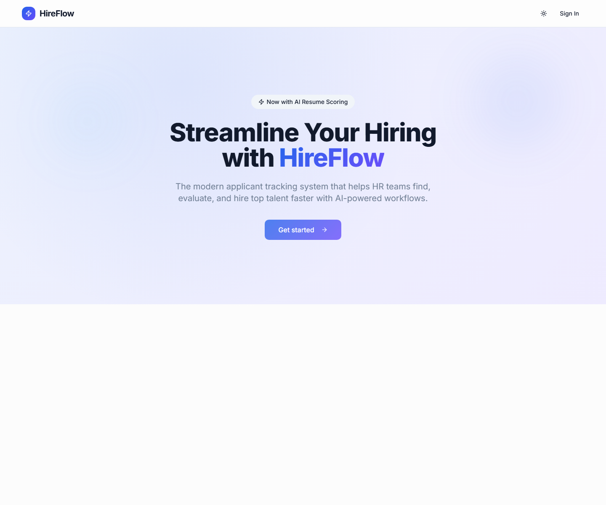
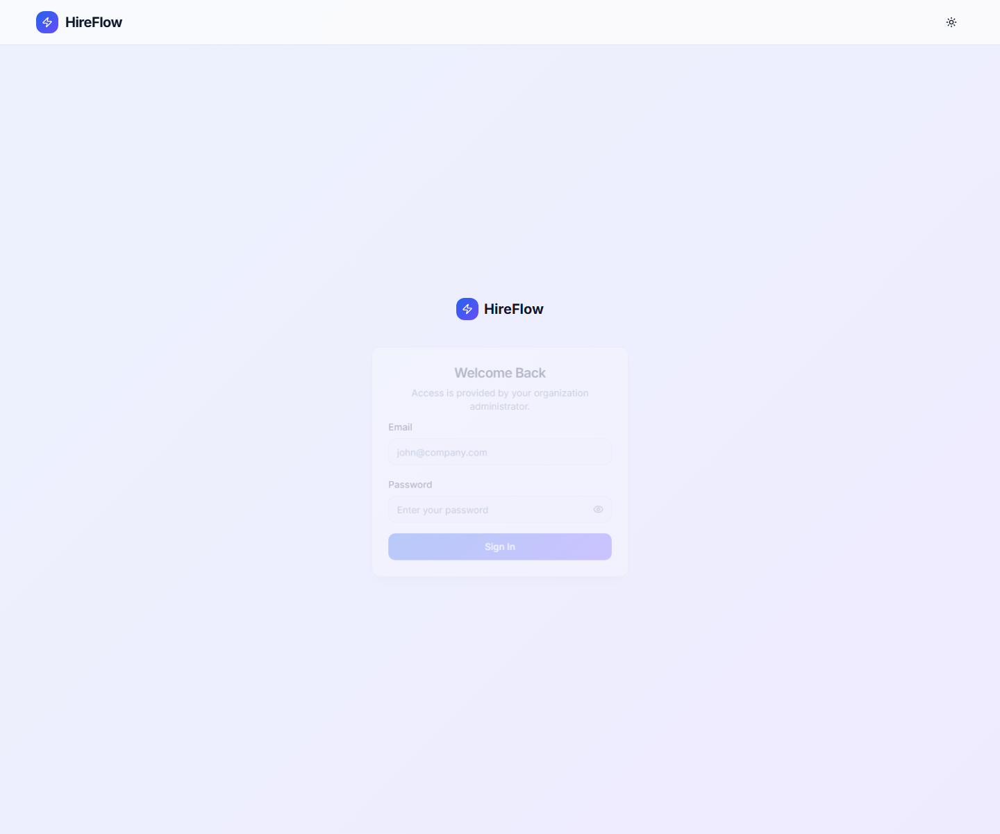

# HireFlow

HireFlow is a full-stack applicant tracking system for managing the hiring lifecycle end to end: sourcing, screening, interviews, offers, analytics, and team access.

## What's In The Current Build

- Public landing, login, job application, candidate status, and public offer pages
- Authenticated workspace for dashboard, jobs, candidates, pipeline, interviews, offers, analytics, users, audit log, profile, and settings
- Role-based access for `viewer`, `recruiter`, and `admin`
- Candidate pipeline with drag-and-drop stage updates and bulk stage moves
- Dashboard views for KPIs, pipeline summary, recent activity, upcoming interviews, and active jobs
- Candidate and job flows for review, scheduling, offer management, and admin operations

## Tech Stack

- Frontend: React, TypeScript, Vite, Tailwind CSS
- Backend: Node.js, Express, MongoDB

## Repository Layout

```text
Hireflow/
  Client/
  Server/
  docs/
    screenshots/
```

## Getting Started

### Prerequisites

- Node.js 18+
- npm
- MongoDB connection string

### 1. Install dependencies

```bash
cd Client
npm install
```

```bash
cd Server
npm install
```

### 2. Configure environment

Create `Server/.env`:

```env
PORT=5000
MONGO_URI=your_mongodb_connection_string
JWT_ACCESS_SECRET=your_access_secret
JWT_REFRESH_SECRET=your_refresh_secret
JWT_ACCESS_EXPIRES_IN=15m
JWT_REFRESH_EXPIRES_IN=7d
CLIENT_ORIGIN=http://localhost:8080
COOKIE_SECURE=false

FIRST_ADMIN_NAME=HireFlow Admin
FIRST_ADMIN_EMAIL=admin@example.com
FIRST_ADMIN_PASSWORD=ChangeMe123
```

### 3. Seed the first admin

```bash
cd Server
npm run seed:admin
```

### 4. Start the app

Backend:

```bash
cd Server
npm run dev
```

Frontend:

```bash
cd Client
npm run dev
```

## Default Local URLs

- Frontend: `http://localhost:8080`
- Backend: `http://localhost:5000`

## Main Routes

### Public

- `/`
- `/login`
- `/apply/:jobId`
- `/status/:token`
- `/offers/:token`

### Workspace

- `/dashboard`
- `/jobs`
- `/jobs/:jobId`
- `/candidates`
- `/candidates/:candidateId`
- `/pipeline`
- `/pipeline/:jobId`
- `/interviews`
- `/offers`
- `/offers/view/:offerId`
- `/analytics`
- `/users`
- `/audit-log`
- `/settings`
- `/profile`

## Screenshots

### Landing Page



### Login Page



## Main Features

- Authentication and role-based access
- Jobs management
- Candidates management
- Interview scheduling
- Pipeline tracking
- Dashboard and analytics
- User management
